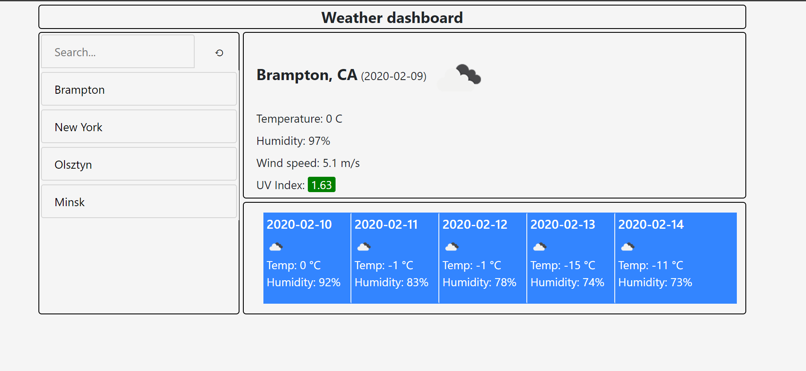

# Weather dashboard


## Application to show weather for selected city

```
Application uses API from https://openweathermap.org/ to display current and 5 day forecast weather data.

There are 3 API calls:
- current weather
- UV index for city
- 5 day forecast for city

```

```
 - User can search city using search box.
 - City will be added to quick search list below. It can be clicked to search again
 - In upper panel user can see current weather conditions for given city
 - in panel below forecast for next 5 days is shown.
 - Searched items are kept on the list during page refresh

 ```

 ```
 Applications uses:

 * bootstrap for some elements
 * moments.js for some date formatting
 * CSS grid layout

 ```

 ```
 GitHub repository: https://github.com/KiteRunner2/BootHomework_06
 GitHub page: https://kiterunner2.github.io/BootHomework_06/index.html

 ```

 

